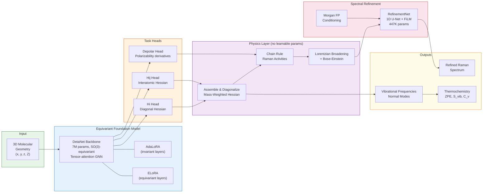
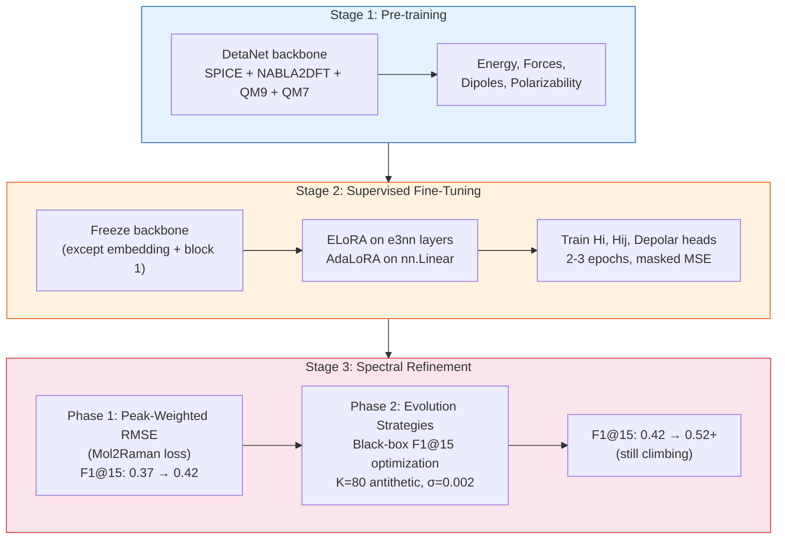
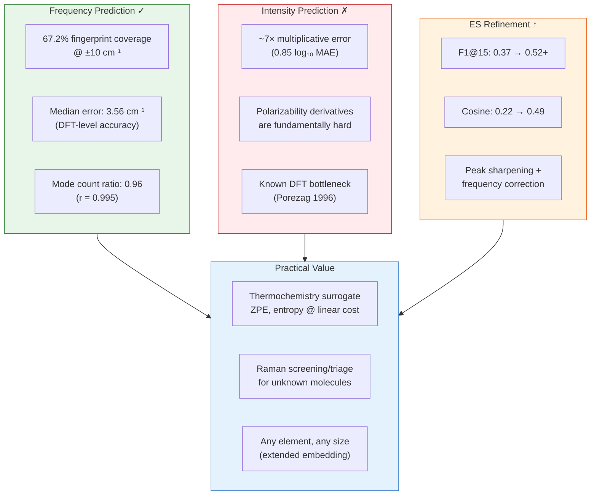

# SpectraLoRA: Graphical Abstract & Paper Narrative

## End-to-End Pipeline

## Training Pipeline

## The OOD Challenge

```mermaid
flowchart LR
    subgraph TRAIN["Training Domain"]
        T1["QM9: ≤9 heavy atoms<br/>C, H, O, N, F only"]
        T2["QM7: ≤7 heavy atoms"]
        T3["SPICE: small organics"]
        T4["NO Raman spectra"]
    end

    subgraph GAP["Domain Gap"]
        G1["3× larger molecules"]
        G2["New elements:<br/>S, Cl, Br, P, Se"]
        G3["Drug-like motifs:<br/>fused heterocycles,<br/>macrocycles, peptides"]
        G4["Zero Raman<br/>supervision"]
    end

    subgraph EVAL["Evaluation Domain"]
        E1["RamanChemBL<br/>512 molecules<br/>Median 24 heavy atoms"]
        E2["RamanBioLib<br/>89 experimental spectra"]
    end

    TRAIN --> GAP --> EVAL

    style TRAIN fill:#E8F5E9,stroke:#2E7D32
    style GAP fill:#FFEBEE,stroke:#C62828
    style EVAL fill:#E3F2FD,stroke:#1565C0
```

## Key Results

## The ES Hill-Climbing Story

```mermaid
flowchart LR
    subgraph FAILED["What Failed ✗"]
        X1["REINFORCE on spectrum<br/>(3501-dim noise → garbage)"]
        X2["Soft-F1 surrogate<br/>(diverges from real F1)"]
        X3["Bigger model<br/>(overfits on 1K molecules)"]
    end

    subgraph WORKED["What Worked ✓"]
        W1["PW-RMSE warm-up<br/>(spectral denoiser)"]
        W2["Evolution Strategies<br/>(parameter-space, not output-space)"]
        W3["Antithetic sampling<br/>(halves variance)"]
    end

    subgraph WHY["Why ES Works"]
        Y1["Perturb WEIGHTS<br/>→ coherent spectrum change"]
        Y2["Optimize EXACT F1<br/>→ zero surrogate mismatch"]
        Y3["375K decoder params<br/>→ tractable search space"]
    end

    FAILED -.->|"lesson"| WORKED
    WORKED --> WHY

    style FAILED fill:#FFEBEE,stroke:#C62828
    style WORKED fill:#E8F5E9,stroke:#2E7D32
    style WHY fill:#E3F2FD,stroke:#1565C0
```

## Paper Narrative Arc

### Act 1: The Foundation (Sections 1-3)
> A 7M-parameter equivariant GNN, adapted via ELoRA/AdaLoRA, predicts the full Hessian matrix + polarizability derivatives from 3D geometry alone. The embedding layer is extended to the full periodic table, enabling inference on any molecule.

### Act 2: The Zero-Shot Challenge (Section 4)
> Evaluated entirely out-of-distribution on drug-like RamanChemBL molecules (median 24 heavy atoms, elements S/Cl/Br/P/Se) — a chemical space fundamentally different from the QM9/SPICE training data. No Raman supervision was ever provided.

### Act 3: What Works (Section 5.1)
> The Hessian surrogate recovers 67% of vibrational modes at DFT-level accuracy (3.56 cm⁻¹ median error). The model produces the correct *number* of modes (ratio 0.96, r=0.995). Frequency prediction is the success story.

### Act 4: What Doesn't (Section 5.2)
> Intensity prediction (~7× error) is the bottleneck, consistent with the fundamental difficulty of polarizability derivatives. This limits spectral fidelity but not thermochemical applications.

### Act 5: The Fix (Section 5.3 — NEW)
> A spectral refinement network (1D U-Net, FiLM-conditioned on molecular fingerprint) is trained in two phases: (1) peak-weighted RMSE for spectral denoising, (2) evolution strategies for direct F1 optimization. ES directly hill-climbs the non-differentiable F1 metric by perturbing model weights — the only approach that worked after REINFORCE and differentiable surrogates failed. F1@15 improves from 0.37 → 0.52+ (still climbing).

### Act 6: The Tool (Section 6-7)
> SpectraLoRA is not a Raman spectrometer replacement. It is a high-throughput physical surrogate: accurate enough for thermochemistry (ZPE, entropy), rough spectral screening, and peak assignment assistance, with amplitude calibration as the identified target for future work. The ES refinement demonstrates that black-box optimization can bridge the gap between physical prediction and spectroscopic metrics.

---

## Figures Checklist

| # | Figure | Status | Location |
|---|--------|--------|----------|
| 1 | System architecture | ✓ | `figures/system.png` |
| 2 | Molecule sizes + coverage by size | ✓ | `figures/fig3_molecule_sizes.png` |
| 3 | Mode count parity | ✓ | `figures/fig_mode_counts.png` |
| 4 | Frequency parity + signed error | ✓ | `figures/fig1_frequency_parity.png` |
| 5 | Intensity Bland-Altman | ✓ | `figures/fig6_intensity_agreement.png` |
| 6 | Sub-band coverage | ✓ | `figures/fig5_subband_coverage.png` |
| 7 | Spectral overlays | ✓ | `figures/stats_broadened_overlays.png` |
| 8 | Tolerance sweep | ✓ | `figures/stats_tolerance_sweep.png` |
| 9 | ES convergence curve | ✓ | `artifacts/refinement_v8/.../fig_es_convergence.png` |
| 10 | ES before/after spectra | ✓ | `artifacts/refinement_v8/.../fig_before_after.png` |
| 11 | ES before/after (v9, final) | ⏳ | waiting for v9 to finish |
